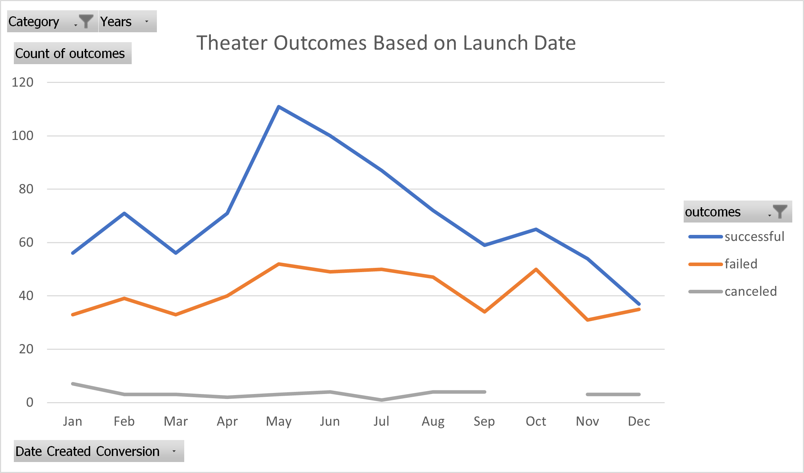
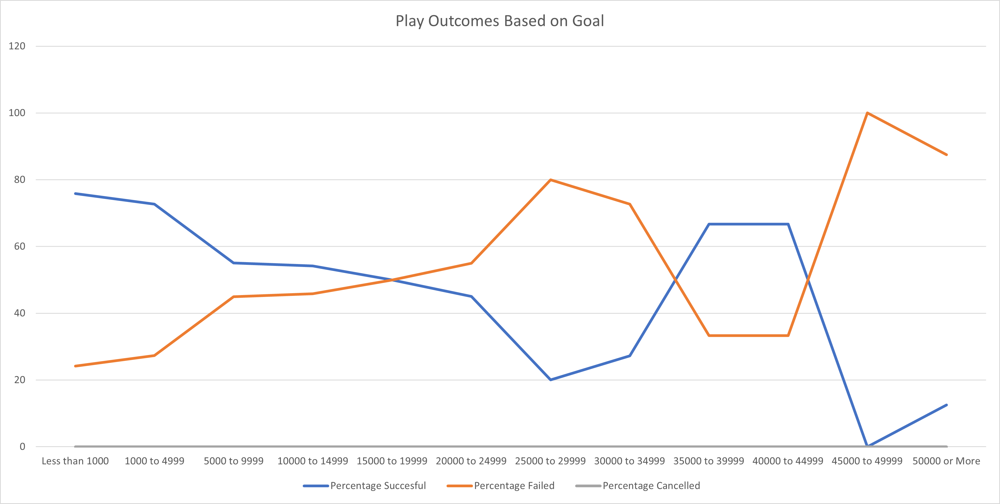

# Kickstarting with Excel

## Table of Contents
- [Overview of Project](#OverviewProject)
  * [Purpose](#purpose)
- [Analysis and Challenges](#Analysis-Challenges)
  * [Analysis of Outcomes Based on Launch Date](#AnalysisLaunch)
  * [Analysis of Outcomes Based on Goals](#AnalysisGoals)
  * [Challenges and Difficulties](#Challenges-Difficulties)
- [Results](#Results)
- [References](#References)
 
## Overview of Project

Lousie, a rising playwriter, is looking to raise $10,000 in order to create her play Fever. Ahead of her crowdfunding endevour, she would like to get previous crowdfunding projects analyzed in order to better understand what makes crowdfunding projects successful. 

### Purpose

The purpose of this repository is to analyze the rate of success of theater crowdfunding projects, more specifically plays, based on their launch date and on their set goals.  

## Analysis and Challenges

This repository contains the analysis of 1369 theater crowdfunding projects, 1066 of which were for plays. The projects were carried out in 19 different countries from 2009 to 2017. Excel was used to interpret the gathered data. 

The outcomes are measured as "successful", "failed", "cancelled" or "live. The criteria used to determine whether a project succeded or failed was solely if the pledged money matched or exceeded the goal. This analysis will be playing closer attention to the relationship between successful and failed projects to their launch date and set goals. 

### Analysis of Outcomes Based on Launch Date

In this first portion of the data analysis, the number of successful, failed and cancelled projects over the years were charted against the month they were launched on. 

During the months of January to April there's a relative steady relationship between the successful and failed projects. The total number of succesful projects exceeded the number of failed projects by about 20-30 projects. 

Porjects have greater success when they are launched in the months between May and August, the most successful being the month of May. 

After the summer months the project's success tapers of and the worst month to launch a project is December. 

  

 Figure 1: Theater Outcomes vs Launch Date
 

### Analysis of Outcomes Based on Goals
 
In this second portion of the data analysis the succesful, failed and cancel projects were grouped in different goal brackets. The percentage of succesful, failed and canceled project was determined for each goal bracket. 

Projects with more modest goals tend to be be more successful. Of the 1047 kickstarter projects for plays, 720 (69%) of them had a goal to raise under $5000. Projects with goals of less than $1000 had 76% of success and projects between $1000 and $4999 had 72% of success.  

Between $5000 and $15000 the rate of success dropped to around 55%. Yet, of the 117 kickstarter failed play projects in this range, 26% of them raised $1000 or more and would've been succesful if the goal was less. Between $15000 and $25000 the rate of failure increases, remaining still close to 50%. The data sample reduces in size as the price increases. 

Once the goal amounts exceed $25,000 the sample size becomes so small that the percentage of succesful and failed kikstarter projects are more affected by a single project. The trend becomes more erratic. 

  

Figure 2: Play Outcomes vs Goals

### Challenges and Difficulties Encountered

The COUNTIFS formula used in the Outcomes Based on Goals sheet gave me erroneous numbers due to a typo. Here are some of the troubleshooting steps I took: 

- 1. I used the "Show Formulas" button under the Formula Tab to be able to see the formulas in the table, and tried to spot the typo there. This proved to be unsuccesful.
- 2. I re-wrote the COUNTIFs formula from scratch and re-arranged so it will filter from the broadest category to the more specific category.
* =COUNTIFS(Kickstarter!$R:$R,"plays")
* =COUNTIFS(Kickstarter!$R:$R,"plays",Kickstarter!$F:$F,"successful")
* =COUNTIFS(Kickstarter!$R:$R,"plays",Kickstarter!$F:$F,"successful",Kickstarter!$D:$D,">=50000")
- 3. For each filtering step of the COUNTIFS formula, I validated the data by filtering the Kickstarter data and selecting cells and checking the cell count. This allowed me to validate my data step by step. 

## Results

- What are two conclusions you can draw about the Outcomes based on Launch Date?

The best month to launch a kickstarted project is May and the worst is December. Yet it is worth mentioning that this clear data trend is formed when compiling the number of projects per month for all the years. When looking at individual years, there is no clear trend as to which months are more successful. The trends for individual years can be looked at by opening the excel file, going to the Theater Outcomes by Launch Date Tab and using the year filter to select individual years. 

- What can you conclude about the Outcomes based on Goals?

If Louis reduced her budget to less than $5000, the chance of her kickstarter to meet her goal would be greater. More modest budgets tend to be more succesful and their success decreases as the goals increase. But once the goals exceed $25,000 the sample size becomes too small and therefore there's not a clear trend passed this goal. 

- What are some limitations of this dataset?

Because not all the play kickstarter projects are being carried in the US, some of the goal and pledged numbers are not measured in USD. Of the 1047 projects, 662 (63%) are measured in USD. The remaining projects are measured in 11 different currencies. If the data is not being measured in the same units, then some of the data points might actually fall under different ranges and the percentage shown in Figure 2 might be incorrect. For example Mexican pesos, as of Feb 2022, are worth 20 times less than a USD. To improve the accuracy of the analysis only US projects should be taken into consideration or all of the data should be converted to one currency. 

The sample size drops as the goals increase, making trends less accurate for the bigger goals.

Success and failure are only measures of the pledged number meeting the goal. There could be failed projects that raised more than $10,000 yet didn't meet their goal and those would be grouped with projects that raised $0. The analysis performed on this charts are counting the number of failures / successes to perform the analysis. Yet the failed projects could be better understood with what percentage of it was funded.

- What are some other possible tables and/or graphs that we could create?

Chart with the percentage funded column would tell a clearer story of what happened to the projects rather than the binary success or failure categories.   

The duration of the kickstarter campaings should be compared to its rate of success. For instance, if some of the kickstarters launched in May tended to have longer campaign durations than the December campaings, that could explain why they tend to be more succesful. 

All of the theater projects that gathered more than $10,000 should be analyzed separately, regardless of their goal. Finding what these projects have in common could be benefitial for Louis. 

##  References

[1]

[2] https://docs.github.com/en/get-started/writing-on-github/getting-started-with-writing-and-formatting-on-github/basic-writing-and-formatting-syntax

[3] https://stackoverflow.com/questions/18244417/how-do-i-create-some-kind-of-table-of-content-in-github-wiki

[4] https://simplernerd.com/md-align-images/

